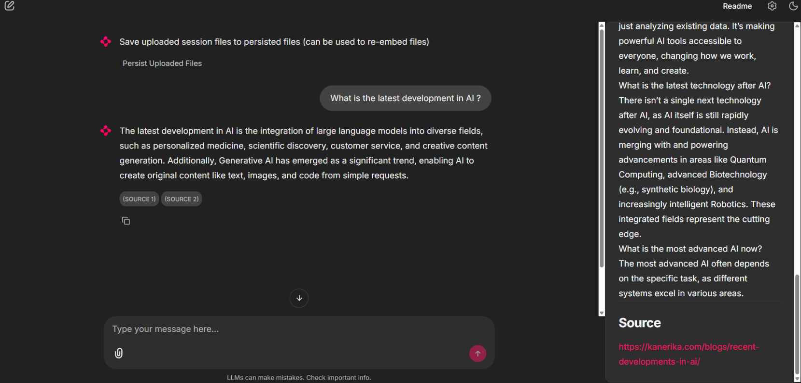
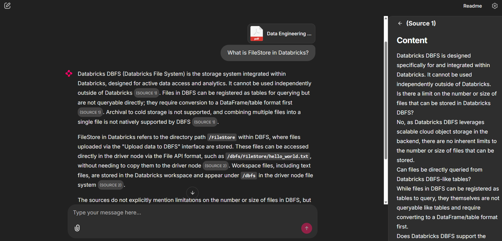
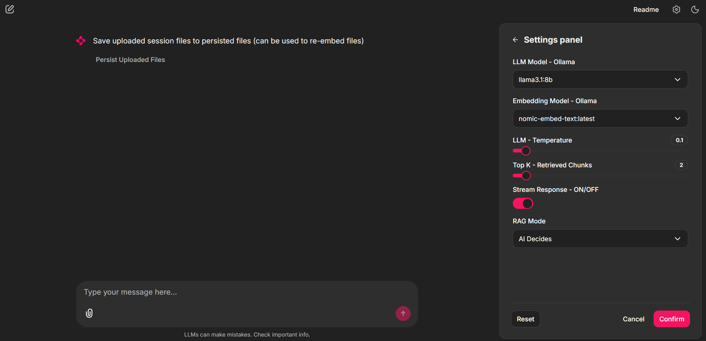

# AI Chatbot (RAG)

A grounded AI assistant that answers questions using either your own documents or live web search, with source-backed responses reducing LLM hallucinations.

<p align="center">
  
</p>

## Features

- Ask questions about your own documents.
- Use web search when you need up-to-date information or when local documents are not enough.
- Show source citations with each answer.
- Maintain a persistent document knowledge base.
- Support temporary session uploads.
- Save useful session files to the long-term knowledge base.
- Automatically choose the most appropriate retrieval mode using AI.
- Allow manual control over retrieval mode, forcing answers to use either local documents or web search.

## Examples

### Local document answer



### Settings panel



## Why it matters

This project demonstrates a practical RAG chatbot that combines:

- Local document retrieval
- Web-based retrieval
- Citation-grounded answers for greater transparency
- Simple knowledge base management
- A fully local runtime with Ollama, running on your own hardware at no cost
- OpenAI SDK compatibility, making it adaptable to any model that supports the OpenAI Responses API

## Tech stack

- Python
- Chainlit
- LlamaIndex
- DuckDuckGo Search
- Ollama
- OpenAI SDK
- LangGraph

## Run locally

Requirements:

- Python 3.10+
- Ollama running locally
- A chat model and an embedding model installed in Ollama

Install dependencies:

```bash
pip install -r requirements.txt
```

Start the app:

```bash
chainlit run src/ragbot/app.py
```
